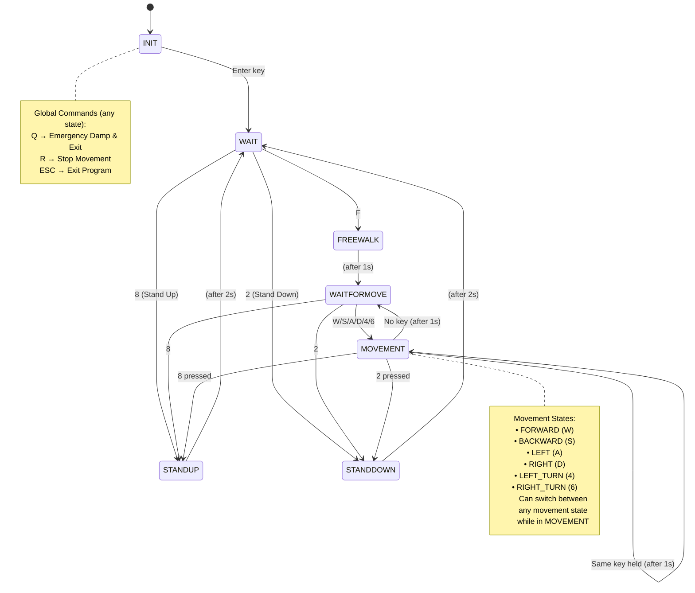

# unitree_interface

This repo contains codebase for interface of unitree robots.

## State Diagram for Interactive Client GO2

```mermaid

stateDiagram-v2
    [*] --> INIT
    
    INIT --> WAIT: Enter key
    
    WAIT --> STANDUP: 8 (Stand Up)
    WAIT --> STANDDOWN: 2 (Stand Down)
    WAIT --> FREEWALK: F
    
    STANDUP --> WAIT: (after 2s)
    STANDDOWN --> WAIT: (after 2s)
    
    FREEWALK --> WAITFORMOVE: (after 1s)
    
    WAITFORMOVE --> STANDUP: 8
    WAITFORMOVE --> STANDDOWN: 2
    WAITFORMOVE --> MOVEMENT: W/S/A/D/4/6
    
    MOVEMENT --> MOVEMENT: Same key held (after 1s)
    MOVEMENT --> STANDUP: 8 pressed
    MOVEMENT --> STANDDOWN: 2 pressed
    MOVEMENT --> WAITFORMOVE: No key (after 1s)
    
    note right of MOVEMENT
        Movement States:
        • FORWARD (W)
        • BACKWARD (S)
        • LEFT (A)
        • RIGHT (D)
        • LEFT_TURN (4)
        • RIGHT_TURN (6)
        
        Can switch between
        any movement state
        while in MOVEMENT
    end note
    
    note right of INIT
        Global Commands (any state):
        Q → Emergency Damp & Exit
        R → Stop Movement
        ESC → Exit Program
    end note
```
